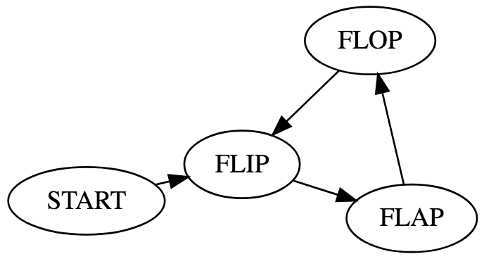

# GameSim

[](https://www.python.org/) [](https://github.com/HarryR/gamesim/blob/master/LICENSE) [](https://GitHub.com/HarryR/gamesim/graphs/commit-activity)

The Game Simulator allows you to model the interaction between multiple state machines, or actors, to derive insights into whether or not it meets your goals by deterministically and stochastically simulating all possible permutations then measuring the probabilities of states and their interdependence.

Work-In-Progress:

 * Probabilities of each state
 * Cycles
 * Visual analysis


## How It Works

The system consists of multiple objects which hold state (or.. variables). Groups of rules are defined which select one or more objects to operate upon, then each individual rule is tested to determine if the object(s) match - if the rule does match then a transform function for each of the objects is called to manipulate that object. It works like a term-rewriting engine.

Every rule that matches creates a new state, then the rules are evaluated again (recursively) on the new state; this results in a permutation of every possible rule being applied in every order, until no more rules match (the terminal state).

Matching is performed with [Pampy](https://github.com/santinic/pampy/), a Pythonic pattern matching engine.


### Writing Rules

You can skip this tutorial and jump straight to the example: [flipflapflop.py](examples/flipflapflop.py)

Rules operate on one or more objects, each object is an instance of a Python `dataclass`, for example:

```python
from dataclasses import dataclass
from enum import Enum

class State(Enum):
    START = 0
    FLIP = 1
    FLOP = 2
    FLAP = 3

@dataclass
class Player:
    state: State = State.START

    def transform(self, new_state):
        self.state = new_state
        return self
```

Each object has functions to manipulate its state, these will be called by the rules later, in this case there's a single function called `transform` which changes the state.

Then define the objects which the system will operate on, in this example we include only one:

```python
objects = [Player()]
```

Rules are described as a list of lists, in the following form:

 * Selector
   * Rules
     * Transforms

```python
from gamesim import System, Group, Selector, Rules

rules = System(
    Group(
        Selector(selector, selector, ...), # Selector, for a group of one or more objects
        Rules(
            # ...
        ),
    ),
    # Another entry...
    # Another entry...
)
```

For this simple game there will be one selector, which chooses a Player (in this case *the player*) to work on, all selectors and matchers use Pampy for pattern matching. In the code immediately below the selector will chose the `Player` object in any state.

Each of the rules is a lambda function which takes the selected objects as its arguments, it returns a tuple of the matchers and then the transforms to be applied to each object. The following rules create a cycle between the states:

```python
from pampy import ANY

rules = System(
    Group(
        Selector(Player(ANY)),
        Rules(
            lambda x: ([Player(State.START)], [lambda o: o.transform(State.FLIP)]),
            lambda x: ([Player(State.FLIP)], [lambda o: o.transform(State.FLAP)]),
            lambda x: ([Player(State.FLAP)], [lambda o: o.transform(State.FLOP)]),
            lambda x: ([Player(State.FLOP)], [lambda o: o.transform(State.FLIP)]),
        )
    )
)
```

A visual representation of this system is:




### More Complicated Games

The Flip-Flap-Flop game above can be extended to support multiple players, with the rules above the state of the two players will never diverge - they will continue forever and will always be in the same state as each other. However, we can add an extra rule which matches them both after the initial transform from `START` to `FLIP` and sets them on divergent paths.

```python
objects = [Player(), Player()]

rules = System(
    Group(
        # Include previous rules and selector here
    ),
    Group(
        Selector(Player(ANY), Player(ANY)),
        Rules(
            lambda x, y: ([Player(State.FLIP), Player(State.FLIP)],
                          [lambda o: o.transform(State.FLAP), lambda o: o.transform(State.FLOP)])
        )
    )
)
```

By adding the extra rule this creates a divergent universe every time any two players are in the `FLIP` state, but because in the divergent universe no two players will be in the same state this limits its growth.

## API

### Run Simulation

Individual steps of the simulation can be executed using `simulate`, and the simulation can be run recursively by calling `simulation`. Both functions take the same arguments:

### Transform

The transform function returns the new state for the object after performing the transform. It takes the object as the first argument.

The following are equivalent for transforms:

 * `lambda o: o`
 * `None` 

If `None` is specified as the transform nothing will happen to the object, it is the same as returning the object.

Alternatively 

```python
class X:
    def transform(self):
        return self
```

which can then be specified as:

```python
Rules(
    lambda x: ([...], [lambda o: o.transform()])
)
```

or

```python
Rules(
    lambda x: ([...], [x.transform])
)
```

If the function returns `None` the same object will be emitted (after the transform is applied).
